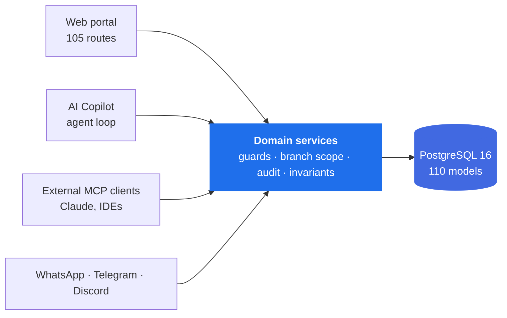
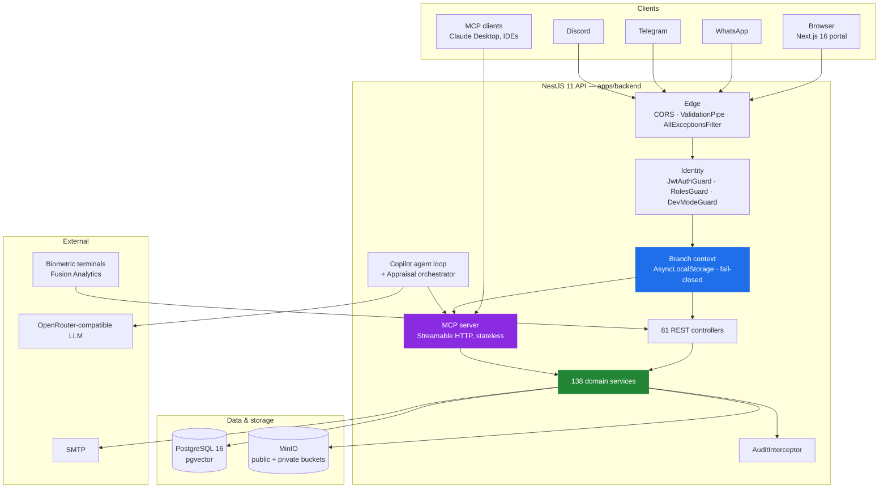
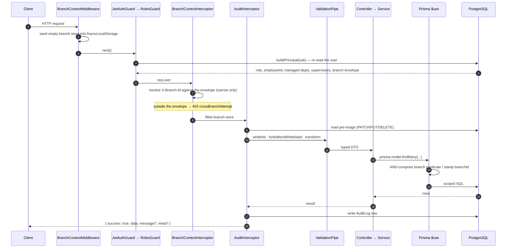
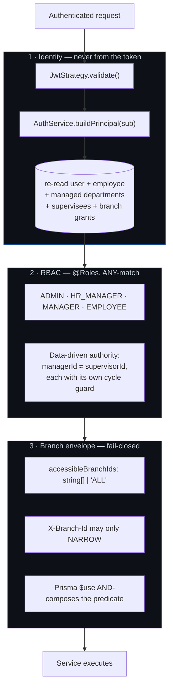
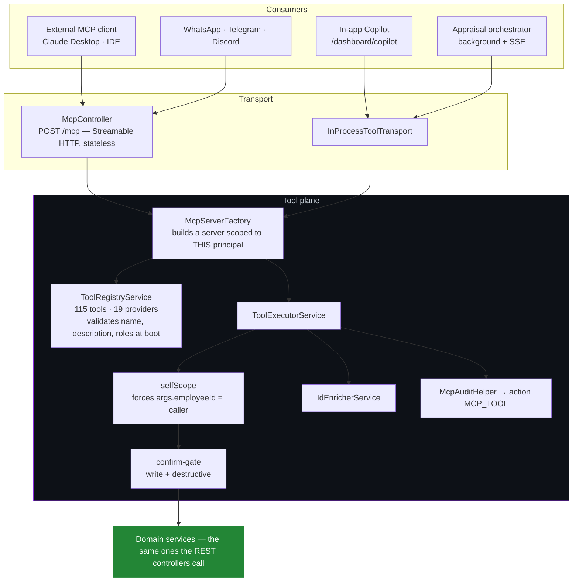
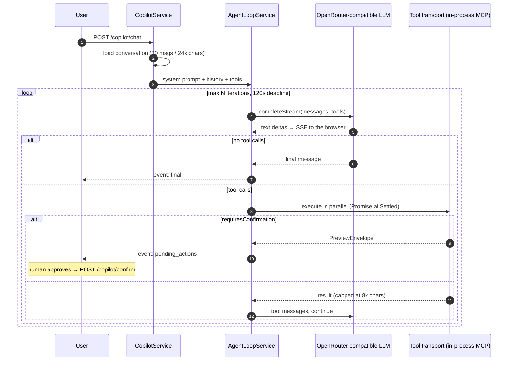
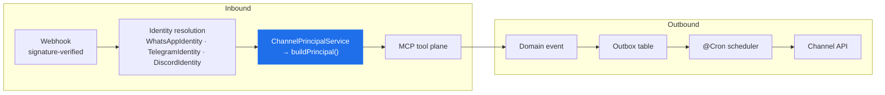
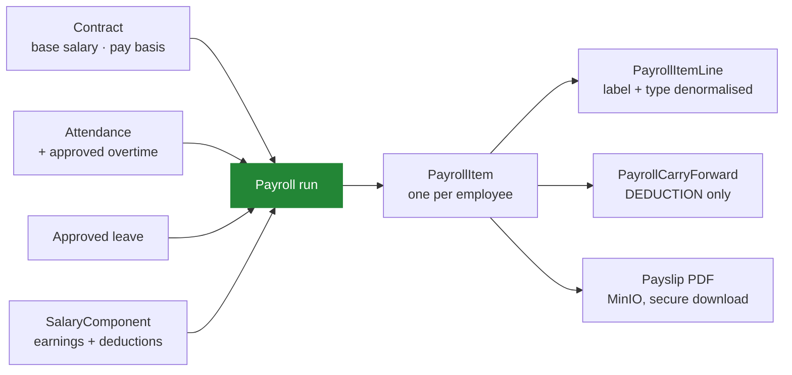
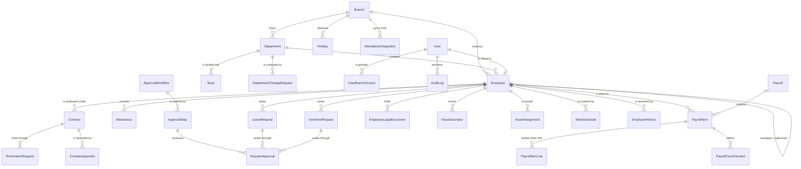
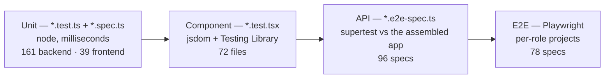

<div align="center">

# People Pay 360

**An HR, payroll and workforce platform with an agent-callable API surface.**

Every capability the portal has, an AI agent has too — over the same guards,
the same branch scoping and the same audit trail. No shadow API, no second
permission model.

[](https://nestjs.com)
[](https://nextjs.org)
[](https://react.dev)
[](https://prisma.io)
[](https://postgresql.org)
[](https://modelcontextprotocol.io)
[](https://typescriptlang.org)

</div>

---

## Contents

1. [The idea in one page](#1-the-idea-in-one-page)
2. [Quick start](#2-quick-start)
3. [System architecture](#3-system-architecture)
4. [Request lifecycle](#4-request-lifecycle)
5. [The security model](#5-the-security-model)
6. [The agent plane — MCP, Copilot, Appraisal](#6-the-agent-plane--mcp-copilot-appraisal)
7. [Omnichannel: WhatsApp, Telegram, Discord](#7-omnichannel-whatsapp-telegram-discord)
8. [Attendance & biometric identity](#8-attendance--biometric-identity)
9. [Payroll engine](#9-payroll-engine)
10. [Data model](#10-data-model)
11. [Frontend architecture](#11-frontend-architecture)
12. [Functional modules](#12-functional-modules)
13. [Domain invariants](#13-domain-invariants)
14. [Testing & CI](#14-testing--ci)
15. [Configuration](#15-configuration)
16. [Commands & ports](#16-commands--ports)
17. [Deployment](#17-deployment)
18. [Repository map](#18-repository-map)

---

## 1. The idea in one page

### The problem

An HR platform is where a company's most consequential and most tedious work
meets. Approving leave, correcting a punch, running payroll, chasing an expiring
visa — each is a five-second decision buried under four screens of navigation.
Meanwhile the people who need to make those decisions are on WhatsApp, not on a
desktop portal.

The obvious fix — "add a chatbot" — usually means a second, weaker API: a bot
service that queries the database directly, re-implements permissions badly, and
becomes the softest target in the system.

### The answer

**One domain layer. Four front doors.**



Every entry point resolves the **same principal object**, built fresh from the
database on every call — never trusted from a token claim. A tool call arriving
over WhatsApp cannot have wider scope than the same person clicking the same
button in the browser, because both traverse the identical service, guard and
audit path.

### By the numbers

| | |
| --- | --- |
| Prisma models · enums | **110** · 21 (≈4,000-line schema) |
| NestJS feature modules · services | **82** · 138 |
| HTTP controllers · route namespaces | 81 · **80** |
| MCP tools · domain tool providers | **115** · 19 |
| Portal routes · React components | **105** · 313 |
| Test files (unit · component · API · E2E) | 161 · 111 · 96 · 78 |

### What makes it different

| Capability | Why it is not the obvious implementation |
| --- | --- |
| **Agent-callable domain layer** | 115 MCP tools are generated from the same services the REST controllers call. A tool inherits the caller's role filter, branch envelope and audit row automatically — there is no bot-only code path to secure separately. |
| **Fail-closed multi-branch scoping** | Branch isolation is enforced in a Prisma `$use` middleware reading `AsyncLocalStorage`, not in 138 hand-written `where` clauses. A model in scope with no branch context matches *nothing*. |
| **Confirm-gate on every mutation** | A write tool called without `confirm: true` executes nothing and returns a preview envelope. The agent must show it to a human and be re-invoked. Destructiveness is a property of the tool definition, not of the prompt. |
| **Server-side face recognition** | The browser ships no recogniser. Descriptors are computed by `face-api` on the server and never travel to a client — a template computed by a different model than the one matching would recognise nobody. |
| **AI appraisal orchestrator** | Performance ranking runs as a background agent over the *same* MCP transport, with SSE progress streaming. It cannot read an employee the requesting user could not read. |
| **Audit as infrastructure** | A global interceptor captures the pre-image of every `POST`/`PUT`/`PATCH`/`DELETE` on any controller carrying `@AuditResource`. MCP tool calls write their own `MCP_TOOL` rows instead. |

---

## 2. Quick start

### Prerequisites

Node 20+ · Docker · npm 10+

### From clone to a populated system

```bash
# 1 — install (npm workspaces installs both apps)
npm install

# 2 — environment — the templates carry working local defaults
cp apps/backend/.env.example  apps/backend/.env
cp apps/frontend/.env.example apps/frontend/.env.local

# ...then set the one value that has no default. The API refuses to boot
# without it, deliberately: a shared default signing key is worse than none.
openssl rand -base64 32          # paste into JWT_SECRET in apps/backend/.env

# 3 — database (pgvector image: the schema declares a vector(384) column)
docker compose up -d postgres
npm run db:push

# 4 — bootstrap seed: roles, library masters, three logins
npm run db:seed

# 5 — the demo dataset: one fully-populated Bengaluru branch
npm run db:seed:bangalore

# 6 — run both apps, prefixed output
npm run dev
```

| | |
| --- | --- |
| Portal | <http://localhost:3010> |
| API | <http://localhost:3011> |
| Swagger | <http://localhost:3011/api/docs> |

### Sign in

`npm run db:seed` creates three accounts:

| Role | Email | Password |
| --- | --- | --- |
| ADMIN | `admin@company.com` | `Admin@123` |
| HR_MANAGER | `hr.manager@company.com` | `Password123!` |
| EMPLOYEE | `employee1@company.com` | `Password123!` |

In a **development** build the sign-in screen offers these as one-click buttons.
The panel is gated on `process.env.NODE_ENV === 'development'`, so a production
build never renders it.

### What the demo seed gives you

`npm run db:seed:bangalore` writes a complete branch — every screen the app
ships renders a record at an *interesting* state rather than an empty table. It
also turns on the feature switches for modules that ship dark
(`document_engine_enabled`, `payroll_item_lines_enabled`,
`face_recognition_enabled`, `geofencing_enabled`, `mcp.enabled`, …), because a
demo of a dark module is a demo of an empty page.

Everything it writes is keyed by three markers — `BLR-` codes, the
`@blr.peoplepay360.com` login domain, and the `SMP-BLR` branch — so it removes
exactly (`SEED_CLEANUP=1 npm run db:seed:bangalore`) and re-runs converge rather
than duplicate.

> **Judge's path.** Sign in as `aarthi.ranganathan@blr.peoplepay360.com`
> (password `Password123!`, ADMIN, all-branch access) and open, in order:
>
> | Route | What is waiting there |
> | --- | --- |
> | `/dashboard/payroll/approvals` | this month's run sits in `PENDING_APPROVAL` |
> | `/dashboard/approvals` | leave, overtime and training each have an `ACTIVE` step |
> | `/dashboard/visa-reports` | one work permit expires in 21 days |
> | `/dashboard/assets` | a laptop is still held by somebody who has left |
> | `/dashboard/departments/change-requests` | a QA manager succession is pending |
> | `/dashboard/copilot` | the agent surface, over the same 115 tools |

The demo logins span every role — ADMIN (global), HR_MANAGER,
PAYROLL_OFFICER, two MANAGERs and four EMPLOYEEs — so role-gating is
demonstrable rather than asserted. The full list prints at the end of the seed.

---

## 3. System architecture

### Context



### Monorepo shape

npm workspaces, two apps, no shared package. The root `package.json` owns only
orchestration scripts and `concurrently`; every real dependency belongs to the
app that uses it. A `packages/` directory earns its place once two apps actually
need the same code — adding it before then buys a build step and nothing else.

```
apps/backend      NestJS 11 · Prisma 5.22 · PostgreSQL 16 · Passport JWT · Swagger · Jest
apps/frontend     Next.js 16 App Router · React 19 · Tailwind 4 · TanStack Query 5 · Zustand 5 · Vitest · Playwright
scripts/          e2e database lifecycle, API test runner
docs/             architecture, per-subsystem walkthroughs, interconnection maps
```

### Layer responsibilities

| Layer | Owns | Must not |
| --- | --- | --- |
| **Controller** | HTTP shape, `@Roles`, `@AuditResource`, DTO validation | contain business rules |
| **Service** | invariants, transactions, cross-module reads | know about HTTP or the caller's transport |
| **MCP tool** | an agent-legible name, description, zod schema, role list | re-implement a rule the service already owns |
| **Prisma middleware** | branch predicate composition, `branchId` stamping | be bypassed by a hand-written query without `rawBranchFilter()` |
| **Interceptors** | branch resolution, audit capture | change the response envelope |

---

## 4. Request lifecycle

Every request — browser, webhook or agent — walks the same path.



### One response envelope

There is exactly one success shape and one failure shape in the system, so the
portal has exactly one contract to unwrap.

```jsonc
// success
{ "success": true, "data": { }, "message": "…", "meta": { "total": 0, "page": 1, "limit": 20, "totalPages": 0 } }

// failure — AllExceptionsFilter, global
{ "success": false, "statusCode": 400, "message": "…", "errors": null, "timestamp": "…", "path": "/employees" }
```

Anything that is **not** an `HttpException` is an internal fault, and its message
is written for a developer reading a log, not for a client. Prisma's in
particular embeds the absolute path of the checkout and an excerpt of the source
around the failing call — a malformed uuid in a path parameter was enough to
provoke one. The full error goes to the server log; the client gets the generic
sentence.

> **Frontend note.** The axios interceptor rejects with a **flat** object. There
> is no `.response` on it. Read `err.message` or call `apiErrorMessage()`;
> reaching for `err.response.data.message` silently falls through to the generic
> fallback. The untouched body is preserved on `details` so a route that answers
> with a per-row report can be re-rendered without a second round trip.

---

## 5. The security model

Three independent mechanisms compose. Passing one is not passing the others.



### 1 · The principal is rebuilt every request

`JwtStrategy.validate()` does not trust the token's claims for authorisation. It
takes the subject and calls `AuthService.buildPrincipal()`, which re-reads the
user, their employee record, every active department they head, every employee
they supervise, and every branch grant. Two consequences, both wanted:

- deactivating an account, revoking a branch grant or moving a department takes
  effect on the **next request**, not at token expiry;
- a non-HTTP entry point resolves an **identical** `req.user`, so a caller
  cannot gain scope by arriving over a different transport. This is exactly why
  `buildPrincipal` lives in `AuthService` rather than inline in the strategy —
  the WhatsApp channel and the MCP endpoint both need the same object.

The login path compares a bcrypt hash **even when the account does not exist**,
and returns the same message either way. Different messages make the endpoint an
account-enumeration oracle; skipping the hash leaks the same fact through
response timing.

### 2 · Roles are an ANY-match, and authority is often data

The RBAC vocabulary is `ADMIN · HR_MANAGER · MANAGER · EMPLOYEE`. But approval
authority is frequently **not** a role: `SUPERVISOR` and `MANAGER` in the
approval engine are *resolvers* that find an assignee at runtime from the data.
`managerId` and `supervisorId` are different graphs — one is where a person sits
in the structure, the other is who signs their leave — and each carries its own
cycle guard.

The workforce-wide attendance views answer **by name** — who was absent, who
arrived late — which is why an employee is refused them while still being
entitled to their own history. That distinction is enforced in the service
rather than by a decorator, because the answer depends on *whose* record it is
and a decorator cannot see that.

### 3 · Branch isolation is middleware, not discipline

```typescript
// PrismaService — registerBranchScoping()
this.$use(async (params, next) => {
  const ctx = getBranchContext();              // AsyncLocalStorage
  if (!ctx || ctx.isAllBranches || !params.model) return next(params);

  const rule = BRANCH_SCOPE[params.model];     // model → how it reaches branch_id
  if (!rule) return next(params);
  // reads + bulk writes: AND-compose the predicate
  // scalar creates:      stamp branchId
});
```

The client-supplied `X-Branch-Id` header is a **view selector**, not a grant: it
can only narrow within the server-derived envelope, never widen it. Requesting a
branch outside the envelope surfaces `crossBranchAttempt`, and the interceptor
decides whether to 403 based on the enforcement mode.

Two deliberate edges:

- **Raw SQL is invisible to the middleware.** `$queryRaw` callers must splice in
  `rawBranchFilter('e')`, which returns `Prisma.empty` for global callers and
  `AND e.branch_id = ANY('{}'::uuid[])` — matching nothing — for a scoped caller
  with an empty envelope. Fail-closed either way.
- **`updateMany`/`deleteMany` accept a scalar-only `where`.** Relation-scoped
  models therefore cannot be auto-scoped for bulk writes; the middleware logs a
  warning and the service is required to guard with `assertInBranch` first.

The portal only sends `X-Branch-Id` for ADMIN and HR_MANAGER. An EMPLOYEE or
MANAGER is pinned server-side, so sending a header for them could only ever
produce *"You do not have access to the selected branch"* — which is precisely
what happened when a stale selection outlived an admin's session.

### Developer-mode elevation

A second, short-lived token (`X-Dev-Token`) kept entirely separate from
`Authorization`. The access token alone never unlocks a gated route, the
login/refresh flow is untouched, and the elevation lives in memory only — so a
reload re-locks. `DevModeModule` is `@Global()` because roughly a dozen
controllers across unrelated modules put `DevModeGuard` in their `@UseGuards`.

### Secrets

`JWT_SECRET` has **no default** and the app crashes at boot without it. A
defaulted signing key is worse than a missing one: every deployment that forgot
to set it shares the same key, and nothing about that is visible until it is
exploited. `SETTINGS_ENCRYPTION_KEY` — which protects integration credentials
stored in `system_settings` — is deliberately separate, so a leaked token key
cannot be escalated into decrypting stored credentials.

---

## 6. The agent plane — MCP, Copilot, Appraisal

This is the part that is not a wrapper.



### The tool contract

Every tool is a typed object, and the registry refuses to boot if one is
malformed — a name that is not `snake_case`, a duplicate, a missing description,
or a tool declaring no roles is a startup crash, not a runtime surprise.

```typescript
export interface McpToolDef {
  name: string;                 // snake_case, domain-prefixed, unique
  description: string;          // verb-first; states units and date formats
  kind: 'read' | 'write' | 'destructive';
  roles: Role[];                // ANY-match — same semantics as RolesGuard
  inputSchema: ZodRawShape;     // executor injects `confirm` for mutations
  selfScope?: { param: string; forRoles: Role[] };
  preview?: (args, user) => Promise<unknown>;
  execute: (args, user) => Promise<unknown>;
  auditResourceType: string;    // matches the existing audit vocabulary
  resourceIdArg?: string;
}
```

**115 tools across 19 domains:** analytics · approvals · assets · attendance ·
departments · employees · holidays · leave · overtime · overtime-policy ·
payroll · projects · reports · shifts · supervisor · tasks · training · visa.

### Four properties that make it safe to hand an LLM

| Property | Mechanism |
| --- | --- |
| **Role filtering is per principal** | `McpServerFactory.build(user)` registers only `toolsForRole(user.role)`. A tool the caller may not use is not merely refused — it is not in the list the model is shown. |
| **Mutations are two-phase** | Calling a `write`/`destructive` tool without `confirm: true` executes nothing and returns a `PreviewEnvelope` carrying `requiresConfirmation`, the preview, and explicit instructions to obtain human approval before re-calling. |
| **Self-scoping is forced, not requested** | `selfScope` overwrites the argument: an EMPLOYEE calling `leave_balance_get` gets *their own* balance regardless of the id the model supplied. |
| **Branch scope is inherited, not passed** | `POST /mcp` is an ordinary authenticated Nest request, so the middleware, guards and interceptor all run first. Tool handlers execute inside that request's async context and pick up branch scoping automatically. |

The endpoint is deliberately **stateless** (`sessionIdGenerator: undefined`,
`enableJsonResponse: true`): no `Mcp-Session-Id`, no SSE stream for a tools-only
surface, and `GET`/`DELETE` answer 405. It is also excluded from the HTTP audit
interceptor — tool-level `MCP_TOOL` rows replace it, because one HTTP POST may
carry several tool calls and a single row would name none of them.

### The Copilot agent loop



The loop is bounded three ways — iteration count (configurable, default 8), a
120-second wall-clock deadline, and an 8,000-character cap per tool result — and
guarded by a per-user rate limit. Tool calls within one turn run in parallel via
`Promise.allSettled`, so one failing tool degrades to an error message in the
transcript rather than aborting the turn. If the endpoint cannot stream, the loop
falls back to a non-streaming completion; the terminal event carries the
authoritative text either way, so a partial stream is harmless.

Model selection, iteration cap, and the MCP/Copilot on-switches live in
`system_settings` first and environment variables second, so they are changeable
from Settings → HR Copilot without a redeploy.

### The Appraisal orchestrator

AI-powered performance ranking, running as a background job with SSE progress
streaming. It reuses the Copilot's LLM client **and** the in-process MCP
transport — which means RBAC, the confirm gate, ALS branch scoping and audit all
apply unchanged. An appraisal run cannot read an employee the requesting user
could not read.

Its per-employee inputs come from `GET /analytics/employees/:id/summary` —
attendance, leave, overtime, tasks, projects, worklogs, timesheets and conduct
for one date range. That route is self-only for unprivileged roles (the id is
caller-supplied, so without the check it would be an "any employee's conduct
record" endpoint for anyone with a login) and the period is **required and
bounded at 366 days**, because an unbounded range over attendance and worklogs
is a table scan per request.

---

## 7. Omnichannel: WhatsApp, Telegram, Discord

Three messaging channels, one shape: an inbound webhook module, an identity
binding, a render layer, and an outbox scheduler.



| Concern | How it is handled |
| --- | --- |
| **Identity binding** | A phone number or chat id is not an identity. `ChannelVerificationToken` issues a single-use link; the browser page it opens is served by a dedicated leaf module registered after every channel. |
| **Step-up verification** | `ChannelFaceVerificationService` can require a face match before a sensitive action completes over a channel. |
| **Discord signature** | Discord signs the **raw** payload with Ed25519, so a re-serialised `JSON.stringify(req.body)` will not verify — key order and whitespace both matter. `main.ts` attaches `rawBody` via the `json({ verify })` hook **only** for `/discord/*`, so no other handler pays the memory. |
| **Delivery** | Every channel writes to an outbox table and a `@Cron` scheduler drains it, so a channel outage delays a message rather than losing it. |
| **Authority** | The channel resolves a principal through `buildPrincipal()` — identical to the web session. Approving leave from WhatsApp is the same call, the same guard and the same audit row as approving it in the portal. |

---

## 8. Attendance & biometric identity

### Face recognition travels one way

The portal ships **no recogniser**. `face-api` (`@vladmandic/face-api` on
TensorFlow.js) runs server-side in the backend. Enrolment posts a JPEG to
`POST /face-recognition/register` and gets back *existence, quality and date* —
never a descriptor.

This is not squeamishness about biometrics in the browser; it is a correctness
requirement. A template computed by a different model than the one doing the
matching would recognise nobody, so the browser is not allowed to try.

**Three captures, from three angles.** One frontal template matches a frontal
pose and little else. The guided flow refuses a capture within 0.3 of one already
on file — a second copy of the same pose spends a slot without adding a pose.

Check-in is geofenced against the branch coordinates, and thresholds
(`FACE_RECOGNITION_THRESHOLD`, `_MAX_DESCRIPTORS`, `_MIN_QUALITY`) are
environment-tunable.

### Terminal integration

`AttendanceIntegration` connections are per branch, with the auth secret
encrypted at rest and a provider registry (`fusion-analytics` ships) that
normalises vendor payloads into `NormalizedAttendanceRecord`. `AttendanceSyncRun`
records each pull, so a gap in the punch record has an explanation.

### Corrections

A disputed punch goes through `AttendanceCorrection`. An approved correction
stamps the attendance row `source: MANUAL`, so a later import **cannot silently
undo a human decision**.

### Rates

Every attendance rate divides by `expected` — the branch's working calendar,
minus holidays and weekly rest, minus approved leave, adjusted by any roster
override — **never by headcount**. Dividing by headcount reports a weekend as a
catastrophe.

---

## 9. Payroll engine

Payroll is deliberately narrow: run payroll, batches, approvals, salary
structures, analytics — plus the payslip screens every role reaches from the user
menu.



| Rule | Reason |
| --- | --- |
| **Money is `Decimal(18, 3)`, never `Float`** | Binary floating point cannot represent 0.1, and a payroll that does not balance is not a payroll. Three decimals because OMR, KWD and BHD are thousandths — `formatCurrency` takes its decimal count from the currency, never from a hardcoded 2. |
| **`gross − insurance − tax == net` holds exactly on the stored row** | Nothing is added or subtracted after the statutory pipeline. Asserted by `payrolls-money-invariants.spec.ts`. |
| **Payslip lines denormalise their label and type** | A payslip is a legal record of what was paid. Resolving the label through the component at display time would silently rewrite history when a component is renamed or retired. |
| **`updateItem` clamps the input, not the answer** | It stores the largest deduction the pay can bear and opens a `PayrollCarryForward` row for the remainder. `DeductionCarryForwardService` collects the rest; on exit an unrecovered row becomes `RECEIVABLE`, never written off silently. |
| **Pay basis is converged at seed time** | The `EMPLOYMENT_TYPE` library item is the source of truth for pay basis. Without convergence a "Daily Wage" employee stays `MONTHLY` and their *per-day* rate is paid as a whole month's salary. Every change writes an `employee_history` row, because flipping the basis re-interprets `baseSalary`. |
| **Only listed run types recover loan instalments** | `PayrollRunType` is `REGULAR · OFF_CYCLE · BONUS · ADJUSTMENT · FINAL_SETTLEMENT`, and one setting gates recovery — closing both "employee receives only a bonus and an EMI is still taken" and "a retro run double-charges an EMI". |

Three feature switches survive: `payroll_item_lines_enabled`,
`payroll_item_lines_strict_reconciliation` (defaults **ON** — the safe state for
"the lines do not add up" is to refuse) and `leave_carry_forward_enabled`.

**Route ordering matters.** `PayrollsModule` is registered before
`PayrollBatchesModule` because `payrolls/reports/...` must match before
`payrolls/:id`, or every report name is read as a payroll id.

---

## 10. Data model

110 models. The core employment graph:



### Conventions

- **Ids are `gen_random_uuid()`**, so a row inserted by hand or by a migration is
  indistinguishable from one the app made.
- **snake_case in the database, camelCase in the client** via `@map`/`@@map`.
- **`pgvector`** — `CompanyKnowledge` stores a `vector(384)` embedding, which is
  why the compose file pins `pgvector/pgvector:pg16` rather than plain
  `postgres:16`. `prisma db push` runs `CREATE EXTENSION vector` and dies on any
  image that does not ship it.

### The configurable approval engine

`ApprovalWorkflow` holds one active ordered chain per request type
(`LEAVE | OVERTIME | TRAINING`). Steps resolve their approver at runtime by
`ApproverType` — `SUPERVISOR` and `MANAGER` are **data-driven assignments, not
RBAC roles**. `ApprovalMode` is `SEQUENTIAL` (a step becomes actionable only
after the previous approver accepts) or `PARALLEL` (every step actionable
immediately; approved once all have accepted).

> The Prisma enum, the backend registry and `lib/approvalKinds.tsx` must agree.
> A value present in one and not the others strands every request of that type
> in an approver's queue.

### Deletion is rare, and history is not editable

Users deactivate; employees terminate; departments refuse to delete while anyone
is assigned; a branch with attendance history behind it deactivates rather than
deleting, because those rows record *where a punch happened* and must keep
resolving. Audit logs and payslips reference these rows and have to keep naming
who acted and who was paid.

The same instinct shapes the request records:

- **A snapshot is the point of a change request.** `DepartmentChangeRequest`
  stores the old value as a column at raise time, so the queue keeps showing what
  somebody objected to even after the department moves on.
- **A renewal never overwrites.** `EmployeeLegalDocument` demotes the superseded
  row to `RENEWED` / `isCurrent: false` and creates a successor pointing back at
  it. An auditor asks *when a permit actually lapsed* — a question about a date
  already past.
- **Approving a termination is the only place employment ends.** The contract and
  the employee record change together, in one transaction; neither moves while
  the request is merely pending.

---

## 11. Frontend architecture

### State, split three ways

| Kind | Tool | Rule |
| --- | --- | --- |
| Server state | TanStack Query | anything the API owns |
| Session / app state | Zustand | `authStore`, `branchStore`, `brandingStore`, `devModeStore`, `globalSearchStore`, `pageHeaderStore` |
| Local state | `useState` | in the component that owns it |

The rule that keeps this from blurring: **if the server is the source of truth,
it does not go in Zustand.**

Query keys are built by a `<entity>Keys` object so invalidation targets the whole
subtree rather than a guessed key.

### The hydration gate

`authStore.hasHydrated` exists because `user: null, isAuthenticated: false` is
ambiguous — it is both *"storage not read yet"* and *"signed out"*. Anything that
**decides** from the session waits for the flag. Without it, every reload flashes
`/login` to a signed-in user.

### The shell

`app/dashboard/layout.tsx` is exactly one viewport tall (`h-dvh overflow-hidden`)
and does not scroll; `<main>` is the only scroller inside it. With a growing
document the rail and the header scrolled off the top of a long page, taking the
navigation and the sign-out control with them. Two consequences follow: the rail
carries its own `overflow-y-auto` (a fully-expanded accordion can be taller than
the window), and the header bar is `shrink-0` so it keeps its height.

The header owns the single `<h1>` for the whole shell — a page declares its text
through `usePageHeader` rather than painting a second heading. The **breadcrumb
trail is deliberately not in the header**: it describes the page rather than the
frame, so it renders at the top of the content area. Both read the same
derivation (`usePageChrome`), which is what stops the heading and the trail
drifting apart.

### One navigation tree, two consumers

`components/dashboard/navConfig.ts` is the single source of truth for the rail
**and** for the tiles on every module landing page. If a landing page re-derived
its list it would drift — a route hidden by a feature flag in the rail would
still be offered as a tile, and the tile would hand the user a 403.

```typescript
interface NavGroup {
  labelKey: string;
  href?: string;          // where the group header points
  basePath?: string;      // the URL prefix this module OWNS, when ≠ href
  unlistedPaths?: string[]; // owned, but deliberately not offered in the rail
  roles: string[];
  children?: NavChild[];
}
```

`basePath` exists for Payroll: its header points at `/dashboard/payroll/manage`,
a **sibling** of the routes it owns, because `/dashboard/payroll` itself is the
payslip screen every role reaches from the user menu. Matching on `href` alone
resolved neither `/dashboard/payroll/:id` nor `/dashboard/payroll` to the module,
and those screens rendered no breadcrumb trail at all.

`unlistedPaths` exists for Projects: reached from the Workplace hub's cards
rather than from the rail. Dropping the nav entry alone would have cost those
screens their trail too, because the trail is derived from this tree.

The rail must never offer a route the server refuses, so `hubRoles` mirrors the
`@Roles` on each aggregate. Where a role may see a group but not open its hub,
`buildMenu` re-points the group header at the first child that role **can** reach
and keeps `basePath`, so the group still owns its URL prefix.

### Module hubs answer in one request

Seven `hub-summary` aggregates — `organization`, `employees`, `attendances`,
`calendar`, `leave-requests`, `talent`, `workplace` — each answer their landing
page with **one** call rather than letting the page fan out to half a dozen list
endpoints and count rows off them. The role dashboard does the same through
`/dashboard/overview`.

| Hub rule | Reason |
| --- | --- |
| **A count is counted in the database** | Reading the length of a list response under-reports every queue longer than one page — on precisely the card whose job is to say how much work is waiting. |
| **A rate is `null`, never `0`** | An empty branch, a role-gated endpoint and a failed request all produce *"no number"*. A card rendering 0.0% for any of them has made a claim the data does not support. The portal renders `null` as an em dash, and the hub hooks expose a `failed` flag so a page can tell *"nothing happened"* from *"we do not know"*. |
| **The server owns every bucket label** | `Aug 2026` arrives formatted, so the browser does no calendar maths. |
| **A named sample is not a count** | `attention.*.names` is capped; `count` is the true total. |
| **An unoffered window is a 400** | `months=7` or `anchor=2026-13-45` is refused, because a page that quietly answers for a period nobody asked about cannot show the reader that it did. |

### Theming and internationalisation

`theme/presets/*` are plain objects. `ThemeProvider` writes them onto `<html>` as
CSS custom properties, and `globals.css` maps those to Tailwind utilities via
`@theme inline`. So `bg-brand-primary` resolves at runtime and **rebranding is
changing one export** in `theme/index.ts` — no rebuild of component styles, no
find-and-replace. Charts are the exception: Recharts reads hex values rather than
CSS variables, so `theme/chartColors.ts` is kept in sync by the same effect that
writes the variables.

**Logical CSS properties only** (`ps-*`, `me-*`, `start-*`), never `pl-*` /
`left-*` — `dir="rtl"` has to flip the layout without a second stylesheet.
`next-intl` provides the message catalogue.

**Date-only values** (hire date, period start) go through `formatDateOnly`, which
does not zone-convert. Putting `2026-01-15` through an instant parse makes it the
14th anywhere west of Greenwich.

> **Permissions in `utils/permissions.ts` are UI affordances, not a security
> boundary.** Every one has a `RolesGuard` counterpart server-side. Never let a
> hidden button be the only thing stopping an action.

---

## 12. Functional modules

### Admin & HR navigation

| Module | Hub | Screens |
| --- | --- | --- |
| **Organisation** | `/dashboard/organization` | Branches · Departments · Org chart · Change requests |
| **People** | `/dashboard/people` | Directory · Add employee · Teams · Contracts · Terminations · Visa reports |
| **Time & attendance** | `/dashboard/time` | Overview · Corrections · Logs · Reports · Manager view · Biometric enrolment |
| **Schedules** | `/dashboard/schedules` | Schedule calendar · Shift management |
| **Leave & overtime** | `/dashboard/leave` | Leave requests · Pending · Balances · Overtime · Log overtime |
| **Payroll** | `/dashboard/payroll/manage` | Run payroll · Batches · Approvals · Salary structures · Analytics |
| **Talent** | `/dashboard/talent` | Appraisals · Training · Rewards & discipline · Grievances |
| **Workplace** | `/dashboard/workplace` | Assets · Letters · *(Projects, unlisted)* |
| **System** | `/dashboard/system` | Settings · Audit logs *(ADMIN only)* |
| **Copilot** | `/dashboard/copilot` | The agent surface |

### Employee self-service

`My time` (attendance, corrections, biometric verification, calendar, leaves,
overtime) · `My pay` (payslips) · `My records` (documents, letters, assets,
training, grievances) · `Approvals` · `My team`.

`approvals` and `my-team` stay **top-level**: their visibility gates match on
`item.href` in the sidebar filter, so demoting either to a child would silently
stop the gate firing.

### Cross-cutting subsystems

| Subsystem | What it does |
| --- | --- |
| **Document engine** | GrapesJS visual templates → Handlebars compile → sanitised HTML → PDF via `puppeteer-core`. Versioned templates, letterheads, brand assets, signatories, batch generation, secure downloads. Gated by `document_engine_enabled`. |
| **Storage** | MinIO with separate public and private buckets. Private objects are never linked directly — a `secure-download` registry mints resolver-checked URLs. |
| **Audit** | Global interceptor on every `@AuditResource` controller; captures the pre-image before the write. MCP tool calls write their own rows. |
| **Notifications** | In-app, email (`@nestjs-modules/mailer`) and the three messaging channels, with per-channel outbox schedulers. |
| **Knowledge / chatbot** | `CompanyKnowledge` with `@xenova/transformers` embeddings in `pgvector` for retrieval. |
| **Task tracker & timesheets** | Projects, sprints, labels, dependencies, configurable status transitions, work logs with running timers, submitted/approved timesheets. |
| **Export** | ExcelJS workbooks for every list surface. |
| **Profile templates** | Admin-defined dynamic employee-profile sections and fields. |
| **Library items** | Central master data (employment types, asset categories, …). Labels are **copied, not FK'd** — the house pattern for values that must survive a master being renamed. |

---

## 13. Domain invariants

The rules that are load-bearing, in one place.

| # | Invariant |
| --- | --- |
| 1 | **One response envelope.** Set globally in `main.ts`; a controller must not hand-roll a different shape. |
| 2 | **The axios interceptor rejects with a flat object.** There is no `.response` on it. |
| 3 | **`NEXT_PUBLIC_*` is build-time.** Inlined by `next build`. Setting one on a running container does nothing; pass it as `--build-arg`. |
| 4 | **`hasHydrated` before any session decision.** |
| 5 | **Money is `Decimal(18, 3)`.** Never `Float`. |
| 6 | **Date-only values go through `formatDateOnly`.** No instant parse. |
| 7 | **Logical CSS properties only.** |
| 8 | **A rate is `null`, never `0`,** when there was nothing to divide by. |
| 9 | **Attendance rates divide by `expected`,** never by headcount. |
| 10 | **A count is counted in the database,** not taken from the length of a page. |
| 11 | **An approved correction stamps `source: MANUAL`.** |
| 12 | **A descriptor travels one way; the browser never makes one.** |
| 13 | **Per-branch settings are nullable and mean "inherit"** — an explicit null, not a copied default, so changing the company value moves every branch that never overrode it. |
| 14 | **`managerId` and `supervisorId` are different graphs,** each with its own cycle guard. |
| 15 | **Soft delete.** Users deactivate, employees terminate, departments refuse to delete while occupied. |

### Adding a backend feature module

`src/<feature>/` with `<feature>.module.ts`, `.controller.ts`, `.service.ts` and
`dto/`. Register it in `app.module.ts` **explicitly** — never rely on a
transitive import. Guards go on the controller class
(`@UseGuards(JwtAuthGuard, RolesGuard)`) with `@Roles(...)` per route.

> **Declare a literal route before its `:id` sibling.** `GET /departments/tree`
> after `GET /departments/:id` is parsed as a uuid and answers 400. Where a
> literal path belongs to a second controller (`/contracts/terminations`,
> `/departments/change-requests`), list that controller **first** in the module's
> `controllers` array.

### Adding a frontend screen

Route under `app/dashboard/`, data through a hook in `hooks/` wrapping a class in
`services/`, types in `types/`, nav entry in `navConfig.ts`.

---

## 14. Testing & CI

Four layers, each answering a question the layer below cannot.



| Layer | Command | Asserts |
| --- | --- | --- |
| Unit | `npm run test:unit` | pure logic — money maths, branch predicates, tool schemas, hub windows |
| Component | `npm run test:component` | a rendered screen's behaviour, in jsdom |
| API | `npm run test:api` | the response envelope, the guards and `forbidNonWhitelisted` against the app **as assembled**, over real HTTP |
| E2E | `npm run test:e2e` | the browser against the running stack, per role |

Two Vitest projects split by **extension**, not directory: `*.test.ts` is pure
and runs in node in milliseconds; `*.test.tsx` renders in jsdom and costs an
order of magnitude more — so `test:unit` stays fast for the tight loop.

Playwright projects are **per role**, and a spec declares its roles in its
**filename** (`people.hr-admin.spec.ts`). A project whose role the name does not
list never loads the file — which matters because `test.skip()` in a body still
schedules the test and still opens a browser before skipping it.

`npm run test:api` loads `.env.test` itself and **refuses to start if that file
does not point at port 8174**. These specs create and approve real rows; running
them against the dev database would rewrite it.

**CI** (`.github/workflows/pr.yml`) runs two parallel jobs on every PR and every
push to `main` — frontend lint → typecheck → test, and backend
`prisma generate` → `db push` → lint → typecheck → test → build against a
service Postgres. `prisma generate` runs **before** typecheck because the
generated client is what every `@prisma/client` import resolves to. Concurrency
is grouped by ref with `cancel-in-progress`, so a busy branch does not queue runs
answering an out-of-date question.

---

## 15. Configuration

**No env file is tracked.** `.gitignore` ignores `.env` and `.env.*` at every
depth and re-includes only `*.example`, so a file that is harmless today cannot
quietly acquire a real key and carry it into the history.

What ships is a pair of templates — `apps/backend/.env.example` and
`apps/frontend/.env.example` — carrying the full key set with working local
defaults. Copy them per machine (see [Quick start](#2-quick-start)). Every value
is a usable local default except `JWT_SECRET` and `SETTINGS_ENCRYPTION_KEY`,
which ship empty on purpose.

### Backend

| Variable | Notes |
| --- | --- |
| `DATABASE_URL` · `DIRECT_URL` | Pooled and direct Postgres URLs |
| `JWT_SECRET` | **No default.** The API refuses to boot without it |
| `JWT_EXPIRES_IN` | Access-token lifetime |
| `SETTINGS_ENCRYPTION_KEY` | Encrypts integration credentials in `system_settings`. Deliberately separate from `JWT_SECRET` |
| `PORT` · `TZ` · `CORS_ORIGIN` | 3011 in dev |
| `FRONTEND_URL` · `BACKEND_PUBLIC_URL` | Used in generated links |
| `MINIO_*` | Endpoint, credentials, public + private buckets. `MINIO_PUBLIC_URL` is the address a **browser** uses |
| `FACE_RECOGNITION_THRESHOLD` · `_MAX_DESCRIPTORS` · `_MIN_QUALITY` | Matching tolerance and enrolment limits |
| `MAIL_*` | SMTP; each key also readable from `system_settings`, which wins |
| `WHATSAPP_*` | Evolution API base URL, instance, key, webhook secret |
| `COPILOT_ENABLED` · `MCP_ENABLED` | On-switches. `system_settings` is consulted **first**, env second |
| `COPILOT_LLM_BASE_URL` · `COPILOT_LLM_API_KEY` | OpenRouter-compatible endpoint |
| `COPILOT_MAX_ITERATIONS` · `_RATE_LIMIT` · `_RATE_WINDOW_MS` · `_PENDING_ACTION_TTL_MINUTES` | Agent-loop bounds |
| `MCP_AUDIT_READS` · `MCP_MAX_ITEMS` | Whether read tools write audit rows; result cap |

### Frontend

| Variable | Notes |
| --- | --- |
| `NEXT_PUBLIC_API_URL` | **Build-time.** Inlined by `next build`; pass as `--build-arg` |
| `NEXT_PUBLIC_APP_NAME` | Build-time |
| `NEXT_PUBLIC_GA_MEASUREMENT_ID` · `NEXT_PUBLIC_GA_DEBUG` | Analytics; every portal **write** is recorded once in the axios interceptor — method, sanitised endpoint and status only, never a body |
| `NEXT_PUBLIC_CLARITY_PROJECT_ID` · `_ALLOW_LOCALHOST` | Session analytics |
| `BACKEND_INTERNAL_URL` | **Runtime, server-side only.** Used by the SSR rewrite and `generateMetadata()`; never sent to the browser |
| `NEXT_DIST_DIR` | Overridable because the build directory is shared state that ports do not isolate — a dev server and a second `next build` in the same checkout otherwise fight over `.next` |

> **`turbopack.root` must be the monorepo root**, not `apps/frontend`. npm
> workspaces hoists `node_modules` to the repo root, so with the app as the root
> Turbopack refuses to compile anything outside it and the build dies with
> *"We couldn't find the Next.js package"*.

---

## 16. Commands & ports

### Commands

| Command | What it does |
| --- | --- |
| `npm run dev` | Backend and frontend together, prefixed output |
| `npm run build` | Builds both apps |
| `npm run lint` | ESLint across both apps |
| `npm run typecheck` | `tsc --noEmit` across both apps |
| `npm test` | Vitest (unit + component) and Jest |
| `npm run test:unit` / `test:component` | One Vitest project each |
| `npm run test:api` | Backend supertest specs, against the e2e database |
| `npm run test:e2e` / `test:e2e:ui` | Playwright — needs `npm run e2e:up` first |
| `npm run e2e:up` / `e2e:down` | e2e Postgres up (schema + seed) / down |
| `npm run db:push` / `db:seed` / `db:studio` | Prisma schema push, bootstrap seed, Studio |
| `npm run db:seed:bangalore` | The full demo branch (`SEED_CLEANUP=1` to undo) |
| `npm run db:seed:blr-today` | Deterministic attendance for today, for a live dashboard |

The backend workspace carries targeted suites of its own —
`test:e2e:payroll`, `test:e2e:leave`, `test:e2e:attendance`, `test:mcp`,
`test:e2e:org`, `test:e2e:talent` and more — for driving one subsystem without
the whole matrix.

### Ports

Offset from the HRM/ESS checkout so both stacks run side by side. **Do not "fix"
them back to 3000/3001.**

| Service | Dev | Docker (host) |
| --- | --- | --- |
| API | 3011 | 8075 |
| Portal | 3010 | 7014 |
| PostgreSQL | 8074 | 8074 |
| MinIO API / console | 9014 / 9899 | 9014 / 9899 |
| e2e PostgreSQL | 8174 | — |

---

## 17. Deployment

```bash
docker compose build
docker compose up -d
```

Four services: `pgvector/pgvector:pg16`, the NestJS API, the Next.js portal, and
MinIO.

| Decision | Why |
| --- | --- |
| **`pgvector/pgvector:pg16`, not `postgres:16`** | The schema declares `extensions = [vector]` and stores a `vector(384)` embedding. `prisma db push` runs `CREATE EXTENSION vector` and dies on an image without it. Same PG 16 data directory, so an existing volume carries over. |
| **`depends_on: service_healthy`** | The backend entrypoint runs `prisma db push` as its first act. Starting it before Postgres accepts connections is a guaranteed crash loop. |
| **`NEXT_PUBLIC_*` under `build.args`, not `environment`** | They are inlined at build time. Setting them in `environment` would have no effect whatsoever. |
| **Container-side `DATABASE_URL` / `MINIO_ENDPOINT` overrides** | `apps/backend/.env` holds the **host-side** values so `npm run dev`, Prisma and Jest work outside Docker. Inside the network the services are reached by compose service name — `localhost` would be the container itself, which presents as a connection timeout at every boot while MinIO was up the whole time. |
| **`MINIO_PUBLIC_URL`** | The address a **browser** uses for public objects. Without it, stored URLs read `http://minio:9000/…` and resolve nowhere outside the compose network. |
| **`output: 'standalone'`** | A self-contained server bundle, eliminating `node_modules` from the production image (≈60% smaller). |

---

## 18. Repository map

```
apps/
  backend/                       NestJS 11 API — 82 modules, 81 controllers, 138 services
    prisma/
      schema.prisma              110 models, 21 enums
      seed.ts                    idempotent bootstrap
      seed-bangalore-demo.ts     the full demo branch
      seed-e2e-baseline.ts       fixture for the API suite
      migrations/ · backfill-*.ts
    src/
      main.ts                    envelope, validation, CORS, Swagger, Discord rawBody
      app.module.ts              explicit registration + interceptor order
      common/
        branch/                  AsyncLocalStorage context, scope map, fail-closed util
        filters/ decorators/ crypto/ verification/ channel/ timezone/ hub/ dynamic-fields/
      auth/                      JWT strategy, buildPrincipal, guards
      prisma/                    PrismaService + branch-scoping $use middleware
      mcp/                       registry · executor · confirm-gate · 19 tool providers
      copilot/ copilot-settings/ agent loop · OpenRouter client · transports
      appraisal/                 AI ranking orchestrator + SSE
      analytics/ dashboard/ payroll-analytics/
      organization-hub/ talent/ workplace/          hub aggregates
      branches/ departments/ employees/ teams/ contracts/ supervisors/ legal-documents/
      attendances/ attendance-corrections/ attendance-integrations/ calendar/ holidays/
      leave-requests/ leave-balances/ leave-attachments/ overtime/ overtime-policy/
      payrolls/ payroll-batches/ salary-components/
      approvals/ notifications/ reminders/ audit/
      documents/ document-vault/ letters/ pdf/ storage/ upload/ export/
      face-recognition/ whatsapp/ telegram/ discord/ chatbot/
      projects/ sprints/ tasks/ labels/ timesheets/ work-logs/ task-dashboard/
      assets/ training/ rewards/ disciplines/ grievances/ library-items/
      users/ system-settings/ profile-templates/ dev-mode/ sample-data/ health/
    test/                        96 supertest specs + live scenarios
  frontend/                      Next.js 16 portal — 105 routes, 313 components
    app/                         (auth)/login · dashboard/* · checkin/[token] · verify/[token]
    components/
      dashboard/navConfig.ts     the single navigation source of truth
      layout/ common/ ui/ module-landing/ charts/ copilot/ ...
    hooks/                       TanStack Query hooks, hub hooks, permissions, page chrome
    lib/                         axios instance + interceptors, api base, query provider, analytics
    services/                    one class per API surface (60+)
    store/                       Zustand: auth, branch, branding, dev-mode, search, page header
    theme/                       tokens, presets, chart colours, runtime CSS variables
    e2e/                         Playwright config, per-role setup, 78 specs
scripts/                         e2e database lifecycle, API test runner
docs/                            architecture, walkthroughs, interconnection maps
```

### Further reading

| Document | Covers |
| --- | --- |
| [docs/ARCHITECTURE.md](docs/ARCHITECTURE.md) | The long form of §3–§5 and §11 |
| [CLAUDE.md](CLAUDE.md) | Short working notes and the non-obvious rules |
| [docs/interconnections-payroll.md](docs/interconnections-payroll.md) | What payroll touches and the contract with each module |
| [docs/leave-overtime-walkthrough.md](docs/leave-overtime-walkthrough.md) | Balance and tier rules, data, seed, tests |
| [docs/schedules-walkthrough.md](docs/schedules-walkthrough.md) | Roster rules and where they deviate from the branch calendar |
| [docs/payroll-walkthrough.md](docs/payroll-walkthrough.md) | The run engine end to end |
| [docs/README.md](docs/README.md) | The full documentation index |

---

<div align="center">

**People Pay 360** · NestJS · Next.js · Prisma · PostgreSQL · MCP

</div>
